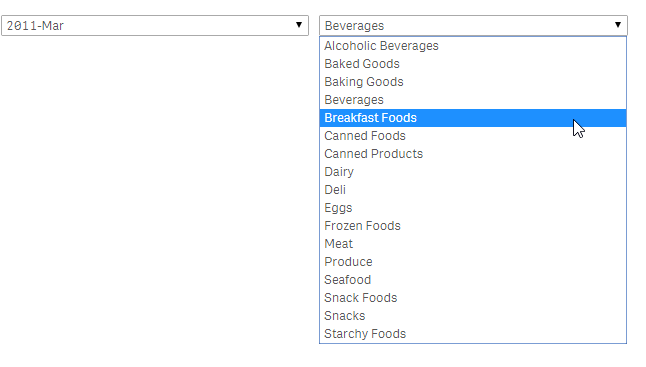

# Qlik-Sense-Dropdown

## Purpose and Description
Dropdown Listbox extension for Qlik Sense. You can make a single selection from the list. 

## Screenshots

## Installation

1. Download the latest version from this Git repository.
2. Qlik Sense Desktop
	* To install, copy all files in the .zip file to folder "C:\Users\[%Username%]\Documents\Qlik\Sense\Extensions\Qlik-Sense-Chartjs"
3. Qlik Sense Server
	* See instructions [how to import an extension on Qlik Sense Server](http://help.qlik.com/sense/en-us/developer/#../Subsystems/Workbench/Content/BuildingExtensions/HowTos/deploy-extensions.htm)

## Author

**Masaki Hamano**
* http://github.com/mhamano

## Change Log

See [CHANGELOG](CHANGELOG.yml)

## License & Copyright
The software is made available "AS IS" without any warranty of any kind under the MIT License (MIT).

See [Additional license information for this solution.](LICENSE.md)
